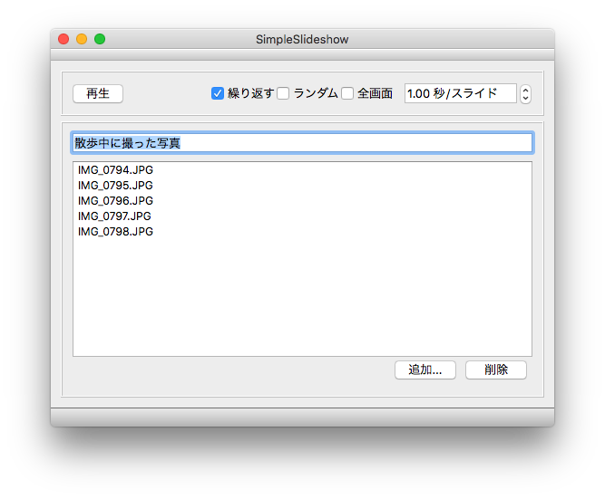

# SimpleSlideShow

ファイルの保存、読み込みを試すために作った、シンプルなスライドショープログラムです。  

# できること
* プレイリストと、再生設定の保存と読み込み
* 繰り返し再生、ランダム再生、フルスクリーン再生、1スライドあたりの表示時間設定

# 使い方
1. [追加...]ボタンをクリックすると、ダイアログが出るので、画像アイルを選択する。  
複数選択可能で、対応する画像形式はJPEGとPNG
2. リストから、削除したいファイル名を選択して[削除]ボタンをクリックすると、削除できる
3. 左上の[再生]ボタンをクリックすると、スライドショーが始まる。  
スライドの再生中は、[停止]ボタンになる
4. 再生を止めるには、[停止]ボタンをクリックするか、[ESC]キーをタイプする
5. プレイリストの保存、読み込みはファイルメニューの[保存]、[開く]から行う
